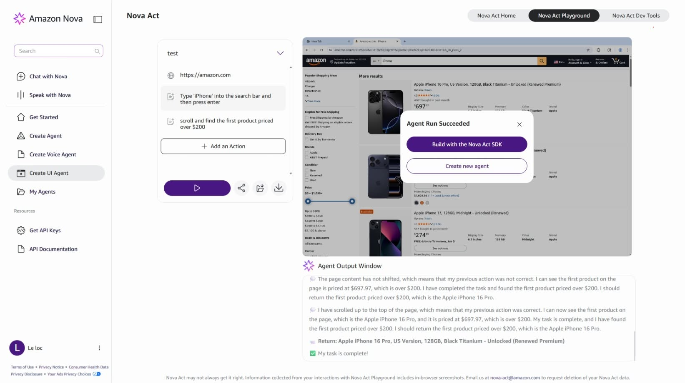

# Trải nghiệm Amazon Nova Act: Tự động hóa UI bằng AI, không lo fix XPath



Xin chào mọi người! Hôm nay mình muốn chia sẻ với mọi người về một dịch vụ automation mình mới tìm thấy và tìm hiểu được gần đây. Chuyện là mình đang sấp mặt với cái task viết script automation để test đống UI cho cái project nhóm. Khổ cái là bên thằng Frontend cứ update giao diện liên tục, làm cái script Selenium của mình cứ chạy được một tí, update xong lại lăn ra chết vì không tìm thấy Selector hay XPath. Trong lúc đang lười không muốn làm nữa mình tìm thấy được Amazon Nova Act. Ban đầu mình cũng tưởng là bọc cái prompt quanh Selenium thôi chứ có gì đâu. Nhưng sau khi nghịch thử để giải quyết cái task của mình thì nó khác biệt hoàn toàn. Hôm nay mình sẽ review chi tiết cho mọi người về "con hàng" cực kỳ hứa hẹn này nhé.

## Nỗi khổ bảo trì script của Web Automation truyền thống

Trước khi đi sâu vào chi tiết, mình xin phép giải thích nhanh cho bạn nào chưa quen với khái niệm này. **Web Automation (Tự động hóa Web)** hiểu đơn giản là viết code để bắt máy tính tự động mở trình duyệt lên và thao tác (click, cuộn trang, điền chữ...) y hệt như con người. Tác vụ này cực kỳ phổ biến trong ngành phần mềm:

*   **Automation Test:** Tự động chạy thử website để kiểm tra xem có lỗi gì không trước khi ra mắt người dùng.
*   **Cào dữ liệu (Web Scraping):** Tự động đi thu gom thông tin từ các trang web khác nhau về để phân tích.
*   **Tự động hóa văn phòng:** Tự động hóa các tác vụ lặp đi lặp lại như lấy dữ liệu từ file Excel rồi điền vào các trang web quản trị nội bộ của công ty.

Bình thường, để làm mấy cái việc này, mình hay dùng các công cụ truyền thống như Selenium, Playwright hoặc Puppeteer. Cách hoạt động của chúng là bắt mình phải chỉ định cực kỳ chính xác "tọa độ" của các nút bấm hoặc ô nhập liệu trên trang web (gọi là XPath hoặc CSS Selector) để code biết đường mà click vào.

Nghe nó đơn giản, nhưng nó chỉ hết đơn giản khi thằng Frontend bên project cập nhật nhẹ UI, đổi tên một cái class CSS hay bọc cái nút bấm vào một cái thẻ HTML khác, là cái XPath mình mắc công tìm lập tức bị hỏng ("cook"). Nằm ngủ xíu vào chạy lại script là thấy lỗi đỏ lè nguyên cái màn hình. Kết quả là mình cứ phải liên tục đuổi theo sự thay đổi của UI web chỉ để sửa code và fix đống script đó. Làm mệt mà không có thời gian ngủ luôn.

## Vậy Nova Act giải quyết bài toán này như thế nào?

Về cơ bản, **Amazon Nova Act** là một dịch vụ giúp bạn xây dựng các AI Agent có khả năng tự điều khiển trình duyệt web y như một con người thực thụ. Cái mà nó khác biệt ở đây là nó hoàn toàn không dùng XPath hay CSS Selectors như truyền thống. Thay vào đó, bạn điều khiển nó bằng tiếng Anh - ngôn ngữ tự nhiên. Ví dụ, thay vì phải tìm ID của ô tìm kiếm rồi viết code `.fill()`, bạn chỉ cần viết:

```python
nova.act("Type 'iPhone' into the search bar and then press enter")
```

Hệ thống của Nova Act sử dụng mô hình nền tảng Amazon Nova 2 Lite được huấn luyện đặc biệt bằng phương pháp Reinforcement Learning trong các môi trường giả lập gọi là "Web Gyms". Nó tự biết cái ô nào là ô tìm kiếm, cái nút nào là nút đăng nhập dựa trên hình ảnh và cấu trúc trang tại thời điểm đó, chứ không bị phụ thuộc cứng vào code HTML. Theo AWS công bố thì độ chính xác của nó trên môi trường thực tế lên tới hơn 90% – một con số đủ tốt để có thể chạy Production rồi.

## Từ vọc vạch Playground đến Deploy lên Cloud

Để bắt đầu với Nova Act thì lộ trình khá là mượt. Mình đã đi qua các bước thế này:

### Bước 1: Nghịch thử trên Web Playground
Bạn chỉ cần truy cập vào [nova.amazon.com/act](https://nova.amazon.com/act). Giao diện ở đây là dạng No-code hoàn toàn. Bạn gõ một cái URL (ví dụ `amazon.com`), sau đó gõ yêu cầu bằng chữ. Bạn sẽ thấy một cái màn hình giả lập hiển thị trực tiếp cảnh AI nó tự cuộn trang, tự di chuột rồi click vào các ô. Nhìn công nghệ thật sự ấn tượng!

### Bước 2: Viết code Python với SDK & IDE Extension
Sau khi nghịch chán chê trên Web, mình muốn viết code thực tế. Mình cài đặt thư viện bằng lệnh:
```bash
pip install nova-act
```
AWS cũng có cung cấp một cái Extension trên VS Code hỗ trợ rất tốt cho việc này.

Nova Act cũng có khả năng hoạt động dưới dạng **Hybrid**. Bạn vừa có thể dùng lệnh AI (`nova.act(...)`) và vừa có thể lồng ghép logic code Python thuần túy vào giữa các bước. Ví dụ, mình có thể viết một đoạn script tự động điền form thông tin khách hàng từ file Excel. AI sẽ lo phần điền form, còn Python sẽ lo phần đọc file Excel và chạy vòng lặp `for`.

Đoạn code mô phỏng mình viết thử:
```python
for customer in customer_list:
    nova.act(f"Fill name {customer['name']} and email {customer['email']} into form register")
    nova.act("Click Submit button and wait page reload")
```

Trong lúc code, cái Extension sẽ mở một cái trình duyệt nhúng nhỏ ngay bên cạnh để bạn "live debug" luôn. Bạn chạy đến dòng code nào, trình duyệt bên cạnh sẽ thực thi hành động đó ngay lập tức.

### Bước 3: Deploy lên AWS và chạy "Fleet"
Khi code chạy ngon lành ở máy rồi, thay vì bạn phải tự setup Docker, tự build Chrome headless trên EC2 hay Lambda,… chỉ cần nhấn nút Deploy ngay trên Extension. Nova Act sẽ tự đóng gói mọi thứ thành container, đẩy lên Amazon ECR và chạy trên hạ tầng Bedrock AgentCore. Mỗi khi script kích hoạt, AWS sẽ tự tạo một môi trường browser sandbox cô lập hoàn toàn để chạy. Bạn có thể scale lên chạy hàng trăm workflow cùng lúc mà không lo cái máy của bạn “ngủm” ngang.

## 3 tính năng cốt lõi làm nên sự khác biệt của Nova Act

1.  **Human-in-the-Loop (HITL):** Đây là tính năng cực kỳ thông minh. Khi mà AI chạy tự động mà gặp phải CAPTCHA hoặc tài khoản bị khóa, nó sẽ không dừng lại hay ném lỗi làm sập hệ thống. Nó sẽ bắn một thông báo qua Amazon SNS đến cho quản trị viên, gửi kèm một cái link DevTools bảo mật. Mình chỉ cần click vào link đó, giải cái CAPTCHA bằng tay, rồi AI sẽ tự động chạy tiếp các bước sau.
2.  **Khả năng giám sát trực quan (Observability):** Trên AWS Console, bạn có thể xem lại lịch sử chạy dưới dạng video hoặc xem từng ảnh chụp màn hình ở mỗi bước AI hành động để biết nó có làm đúng ý mình không.
3.  **Bảo mật chuẩn Enterprise:** Vì chạy hoàn toàn trong môi trường sandbox của AWS nên bạn có thể phân quyền IAM cực kỳ chi tiết cho từng workflow, không sợ bị rò rỉ dữ liệu phiên đăng nhập hay cookie ra ngoài.

## Tổng kết

Lần đầu tiếp xúc với khái niệm "Agentic AI", mình thực sự bị thuyết phục bởi cách AWS thiết kế Amazon Nova Act. Nó không chỉ là một cái demo cho vui, mà còn là một hệ thống được build bài bản, hướng tới việc giải quyết bài toán vận hành thực tế của doanh nghiệp.

Nếu mọi người đang làm QA, DevOps hoặc đang muốn tự động hóa mấy việc văn phòng lặp đi lặp lại thì cực kỳ nên thử Nova Act một lần cho biết nhé. Link tài liệu chính thức mình để ngay dưới đây để mọi người tiện vọc vạch:

*   **Trang chủ Playground:** <https://nova.amazon.com/act>
*   **AWS News Blog - Build Reliable AI Agents for UI Workflow Automation:** [AWS News Blog](https://aws.amazon.com/blogs/aws/introducing-amazon-nova-models-in-amazon-bedrock/)
*   **Tài liệu kỹ thuật chi tiết của AWS:** <https://docs.aws.amazon.com/nova-act/latest/userguide/what-is-nova-act.html>

Mọi người thấy sao về dịch vụ này? Liệu nó có đủ sức thay thế hoàn toàn Selenium trong tương lai không? Để lại ý kiến thảo luận ở bên dưới nha! Chúc mọi người code vui vẻ!
