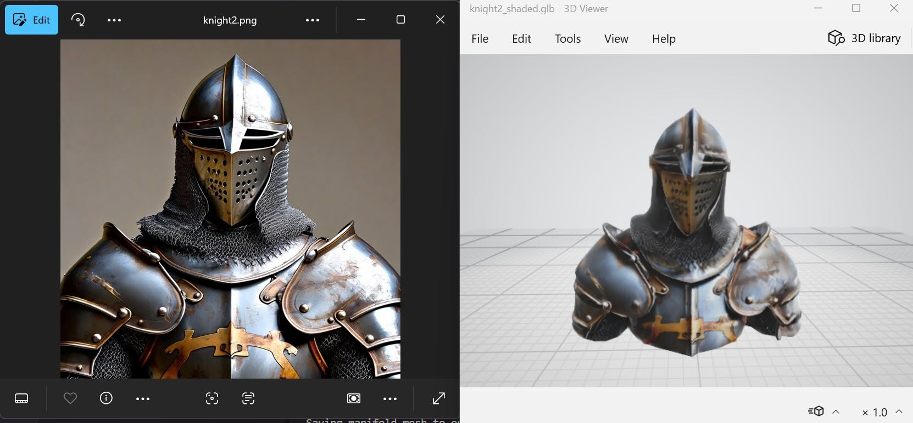

# Generating 3D Models from 2D Images using AI on AWS



## 1. Proposed Architecture Overview

To balance graphics processing performance (GPU) and costs, our workflow is divided into two primary computing stages connected via Amazon S3 storage:

*   **Amazon S3 (Central Storage):** Stores the initial 2D concept drawings and output `.glb` files (3D objects) generated at each step.
*   **Step 1 - Mesh Generation (Amazon EC2 g4dn.2xlarge):** Uses `g4dn` instances equipped with Nvidia GPUs. The instance downloads the image from S3, uses the **TripoSG** model to compute and generate the basic geometry mesh, and pushes the file back to S3.
*   **Step 2 - Texture Generation and Projection (Amazon EC2 g6e.2xlarge):** The multi-view texturing phase requires massive vRAM. The **MV-Adapter** model uses the original 2D image as a reference to project multi-angle textures onto the mesh generated in Step 1.

## 2. Practical Implementation & Cost Optimization

The first step is setting up the network infrastructure and selecting the correct Amazon Machine Image (AMI). Developers should utilize Deep Learning AMIs (pre-installed with CUDA and PyTorch) to save time configuring the environment.

> [!TIP]
> **Cost Optimization Pro-Tip:** GPU-powered EC2 instances like `g4dn` or `g6e` are expensive hourly resources. If you are an IT student or junior developer, actively participate in events like the "Platform First Cloud AI Journey Bootcamp" or AWS Vietnam workshops. Completing tasks to receive 100 AWS credits provides ample budget to test these instances during R&D without burning a hole in your pocket.

### Launching the Environment and Fixing Mesh Errors

When using MV-Adapter for texturing, a common technical issue is that AI-generated meshes (from Tripo) sometimes suffer from "non-manifold" geometry (invalid self-intersecting faces or open holes).

To prevent the pipeline from crashing, we need a script to repair the mesh directly on the EC2 instance before texturing:

```bash
python fix_manifold.py inputs/raw_model.glb inputs/manifold_model.glb
```

Then, run the texture generation command:

```bash
python -m scripts.texture_i2tex --image inputs/concept.jpeg --mesh inputs/manifold_model.glb --save_dir outputs --remove_bg
```

## 3. Bringing AI Assets into the Game Engine (The Final Piece)

Many tutorials stop after creating the `.glb` file, treating it as the end goal. However, for a Game Developer, that is just raw material. AI-generated files often have unoptimized polygon counts and, naturally, lack a skeletal rig.

We need tools like **Blender** to optimize the model and add a skeleton (e.g., using the **"Rigify"** plugin). Additionally, you can upload the model to **Mixamo** to auto-rig it and apply existing animations available on the platform.

## 4. Conclusion

Using open-source AI models like TripoSG and MV-Adapter on AWS EC2 grants you complete ownership of the 3D asset generation process without being limited by external APIs. While current AI outputs cannot fully replace professional 3D artists, they serve as a powerful tool during prototyping. Automating this step saves developers countless hours, allowing them to focus on what matters most: gameplay design and script logic.

**Reference Source:** <https://aws.amazon.com/blogs/gametech/open-source-3d-game-asset-generation-using-aws>
