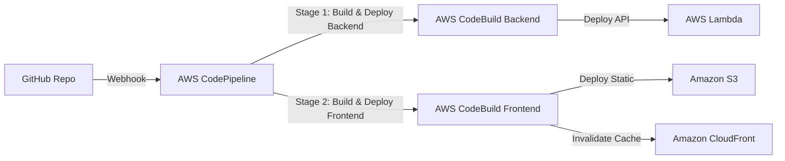

#### CI/CD Overview

In the previous chapters, you manually deployed the frontend and backend using commands directly from your local computer. In a production environment, we automate this process using a **CI/CD (Continuous Integration / Continuous Delivery)** pipeline.

In this step, we will configure **AWS CodePipeline** and **AWS CodeBuild** to automatically build and deploy the project whenever you push code to the `main` branch on **GitHub**.

---

### Project Pipeline Architecture



---

### Step 1: Create Buildspec Configuration Files

Create two configuration files at the root of your project repository to instruct AWS CodeBuild how to compile and deploy your application.

#### 1. Backend Configuration File (`buildspec-backend.yml`):
```yaml
version: 0.2

phases:
  install:
    runtime-versions:
      nodejs: 20
    commands:
      - echo Installing Serverless Framework and dependencies...
      - npm install -g serverless@3
      - cd backend && npm install
  build:
    commands:
      - echo Deploying backend using Serverless Framework...
      - npx serverless deploy --stage prod
```

#### 2. Frontend Configuration File (`buildspec-frontend.yml`):
```yaml
version: 0.2

phases:
  install:
    runtime-versions:
      nodejs: 20
    commands:
      - echo Installing frontend dependencies...
      - cd frontend && npm install
  build:
    commands:
      - echo Building frontend app...
      - npm run build
  post_build:
    commands:
      - echo Deploying build files to S3...
      - aws s3 sync dist/ s3://ai-assistant-frontend-prod --delete
      - echo Invalidating CloudFront cache...
      - aws cloudfront create-invalidation --distribution-id EXXXXXXXXXXXX --paths "/*"
```
*Replace `EXXXXXXXXXXXX` with your actual CloudFront Distribution ID.*

---

### Step 2: Configure AWS CodeBuild Projects

We need to create two Build Projects, one for the Frontend and one for the Backend.

**Via AWS Console:**

#### 1. Create a CodeBuild Project for the Backend:
1. Open the **CodeBuild** console -> click **Create build project**.
2. Configure:
   - **Project name**: `ai-assistant-backend-build`.
   - **Source**: Select **GitHub**. Authorize (OAuth) your GitHub account and select your project repository.
   - **Environment**:
     - **Environment image**: Managed image.
     - **Operating system**: Amazon Linux.
     - **Runtime(s)**: Standard.
     - **Image**: `aws/codebuild/amazonlinux-x86_64-standard:5.0` (or the latest image supporting Node 20).
     - **Service role**: Select **New service role** (so CodeBuild creates the appropriate IAM role automatically).
   - **Buildspec**: Select **Use a buildspec file** -> enter path: `buildspec-backend.yml`.
3. Click **Create build project**.
4. **Grant permissions to the CodeBuild Role**: Since CodeBuild needs permissions to deploy Lambda, API Gateway, and CloudFormation via Serverless, open the **IAM** console -> search for the service role created for this build project and attach the **`AdministratorAccess`** policy (or narrower policies for CloudFormation, Lambda, API Gateway).

#### 2. Create a CodeBuild Project for the Frontend:
1. Create a project similarly with the following changes:
   - **Project name**: `ai-assistant-frontend-build`.
   - **Buildspec**: Enter path: `buildspec-frontend.yml`.
2. Click **Create build project**.
3. **Grant permissions to the CodeBuild Role**: This role needs S3 sync and CloudFront invalidation permissions. Attach **`AmazonS3FullAccess`** and **`CloudFrontFullAccess`** policies to the IAM role created for this project.

---

### Step 3: Create AWS CodePipeline with GitHub Integration

**Via AWS Console:**
1. Open the **CodePipeline** console -> click **Create pipeline**.
2. **Step 1: Choose pipeline settings**:
   - **Pipeline name**: `ai-assistant-deployment-pipeline`.
   - **Service role**: Select **New service role**.
3. **Step 2: Add source stage**:
   - **Source provider**: Select **GitHub (Version 2)**.
   - **Connection**: Select your GitHub connection (or create one by clicking Connect to GitHub).
   - **Repository name**: Select your project repository.
   - **Branch name**: Select `main`.
4. **Step 3: Add build stage**:
   - **Build provider**: Select **AWS CodeBuild**.
   - **Project name**: Select `ai-assistant-backend-build`.
5. **Step 4: Add deploy stage**:
   - *Click **Skip deploy stage** since the backend deployment runs directly inside CodeBuild via Serverless Framework.*
6. Click **Create pipeline** to complete.

#### Adding the Frontend Deploy Stage to the Pipeline:
1. Open the newly created pipeline and click **Edit** at the top.
2. Scroll to the bottom of the existing Build stage and click **+ Add stage** -> name it `DeployFrontend`.
3. Inside the new stage, click **+ Add action group**:
   - **Action name**: `BuildAndDeployFrontend`.
   - **Action provider**: Select **AWS CodeBuild**.
   - **Input artifacts**: Select **SourceArtifact**.
   - **Project name**: Select `ai-assistant-frontend-build`.
4. Click **Done** -> click **Save** to update the pipeline.


---

### Step 4: Verify the Pipeline

1. Make a small code change in the Frontend code (e.g., change the page title in `frontend/src/pages/HomePage.jsx`) or the Backend.
2. Commit and push your changes to the `main` branch:
   ```bash
   git add .
   git commit -m "Test automated CI/CD pipeline"
   git push origin main
   ```
3. Open the **CodePipeline** console. You should see the pipeline transition to **In Progress**, fetching the latest code from GitHub, deploying the backend updates, and copying the frontend build to S3.


