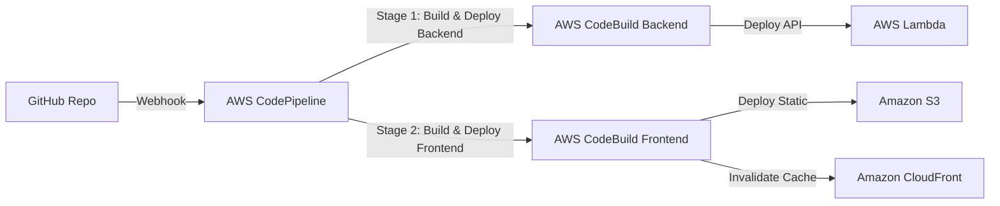

#### Tổng quan về CI/CD

Trong các chương trước, bạn đã triển khai thủ công frontend và backend bằng lệnh trực tiếp trên máy tính cá nhân. Trong môi trường thực tế, chúng ta cần tự động hóa quy trình này bằng luồng **CI/CD (Continuous Integration / Continuous Delivery)**. 

Trong bước này, chúng ta sẽ thiết lập **AWS CodePipeline** kết hợp với **AWS CodeBuild** để tự động build và deploy dự án mỗi khi bạn push code lên nhánh `main` của **GitHub**.

---

### Kiến trúc Pipeline của dự án



---

### Bước 1: Tạo file cấu hình Buildspec

Tạo hai tệp cấu hình tại thư mục gốc của repository dự án của bạn để hướng dẫn AWS CodeBuild cách biên dịch và triển khai ứng dụng.

#### 1. File cấu hình Backend (`buildspec-backend.yml`):
```yaml
version: 0.2

phases:
  install:
    runtime-versions:
      nodejs: 20
    commands:
      - echo Installing Serverless Framework and dependencies...
      - npm install -g serverless@3
      - cd backend && npm install
  build:
    commands:
      - echo Deploying backend using Serverless Framework...
      - npx serverless deploy --stage prod
```

#### 2. File cấu hình Frontend (`buildspec-frontend.yml`):
```yaml
version: 0.2

phases:
  install:
    runtime-versions:
      nodejs: 20
    commands:
      - echo Installing frontend dependencies...
      - cd frontend && npm install
  build:
    commands:
      - echo Building frontend app...
      - npm run build
  post_build:
    commands:
      - echo Deploying build files to S3...
      - aws s3 sync dist/ s3://ai-assistant-frontend-prod --delete
      - echo Invalidating CloudFront cache...
      - aws cloudfront create-invalidation --distribution-id EXXXXXXXXXXXX --paths "/*"
```
*Thay thế `EXXXXXXXXXXXX` bằng ID CloudFront Distribution của bạn.*

---

### Bước 2: Thiết lập AWS CodeBuild Projects

Chúng ta cần tạo 2 Build Project cho Frontend và Backend.

**Console:**

#### 1. Tạo Project CodeBuild cho Backend:
1. Mở dịch vụ **CodeBuild** -> Chọn **Create build project**.

2. Cấu hình:
   - **Project name**: `ai-assistant-backend-build`.
   - **Source**: Chọn **GitHub**. Thực hiện kết nối (OAuth) tới tài khoản GitHub của bạn và chọn repository dự án.
   
   - **Environment**:
     - **Environment image**: Managed image.
     - **Compute**: Lambda.
     - **Runtime(s)**: Node.js.
     - **Image**: `aws/codebuild/amazonlinux-x86_64-standard:5.0` (hoặc bản mới nhất có hỗ trợ Node20).
     - **Service role**: Chọn **New service role** (để CodeBuild tự tạo vai trò IAM có quyền hạn phù hợp).
     
   - **Buildspec**: Chọn **Use a buildspec file** -> nhập đường dẫn: `buildspec-backend.yml`.
   
 3. Nhấn **Create build project**.
4. **Cấp thêm quyền cho Role của CodeBuild**: Do CodeBuild cần quyền deploy Lambda, API Gateway và CloudFormation qua Serverless, truy cập dịch vụ **IAM** -> Tìm Role của project vừa tạo và gán policy **`AdministratorAccess`** (hoặc cấp các policy hẹp hơn của CloudFormation, Lambda, API Gateway).

#### 2. Tạo Project CodeBuild cho Frontend:
1. Tạo tương tự như trên với các thay đổi sau:
   - **Project name**: `ai-assistant-frontend-build`.
   - **Buildspec**: Nhập đường dẫn: `buildspec-frontend.yml`.
2. Nhấn **Create build project**.

3. **Cấp thêm quyền cho Role của CodeBuild**: Role này cần quyền đồng bộ S3 và tạo invalidation trên CloudFront. Hãy gắn policy **`AmazonS3FullAccess`** và **`CloudFrontFullAccess`** cho IAM Role của project frontend build này.

---

### Bước 3: Tạo AWS CodePipeline kết nối GitHub

**Console:**
1. Mở dịch vụ **CodePipeline** -> chọn **Create pipeline**.

2. **Step 1: Choose creation option**:
   - **Category**: chọn **Deployment**.
   - **Template**: Chọn **Push to ECR**.
   
3. **Step 2: Choose source**:
   - **Source provider**: Chọn **GitHub (via Github app)**.
   - **Connection**: Chọn kết nối GitHub của bạn (hoặc tạo mới bằng cách nhấn Connect to GitHub).
   - **Repository name**: Chọn repository của bạn.
   - **Branch name**: Chọn `main`.
4. **Step 3: Add build stage**:
   - **Build provider**: Chọn **AWS CodeBuild**.
   - **Project name**: Chọn `ai-assistant-backend-build`.
5. **Step 4: Add deploy stage**:
   - *Bước này có thể nhấn **Skip deploy stage** vì luồng deploy backend đã được chạy trực tiếp trong lệnh buildspec qua Serverless Framework.*
6. Nhấn **Create pipeline** để hoàn tất.

#### Cách thêm Stage triển khai Frontend vào Pipeline:
1. Mở pipeline vừa tạo, nhấn nút **Edit** ở trên cùng.
2. Cuộn xuống cuối stage Build cũ, nhấn **+ Add stage** -> Đặt tên: `DeployFrontend`.
3. Trong Stage mới, nhấn **+ Add action group**:
   - **Action name**: `BuildAndDeployFrontend`.
   - **Action provider**: Chọn **AWS CodeBuild**.
   - **Input artifacts**: Chọn **SourceArtifact**.
   - **Project name**: Chọn `ai-assistant-frontend-build`.
4. Nhấn **Done** -> Chọn **Save** để cập nhật pipeline.
